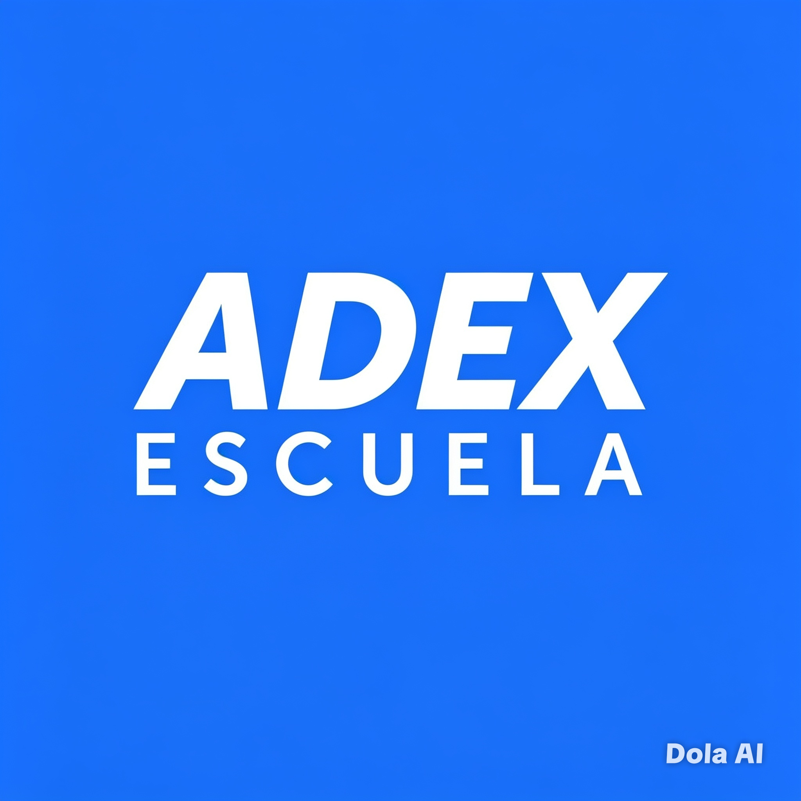

<!DOCTYPE html>
<html lang="es">
<head>
  <meta charset="UTF-8">
  <meta name="viewport" content="width=device-width, initial-scale=1.0">
  <title>Unidad Didáctica: Creatividad e Innovación | ADEX • Grupo 3</title>
  
  <link href="https://cdn.jsdelivr.net/npm/font-awesome@4.7.0/css/font-awesome.min.css" rel="stylesheet">
  <link rel="preconnect" href="https://fonts.googleapis.com">
  <link rel="preconnect" href="https://fonts.gstatic.com" crossorigin>
  <link href="https://fonts.googleapis.com/css2?family=Inter:wght@300;400;500;600;700&display=swap">
  
  
</head>
<body class="bg-gradient-to-br from-adex-azulOscuro via-adex-azulMedio to-adex-azulClaro min-h-screen font-sans text-white overflow-x-hidden">

  

    

    

  

  <main class="relative z-10 max-w-4xl mx-auto px-4 py-10 md:py-16">

    

      
    

    <section class="anim-escala retraso-1 bg-white/10 backdrop-blur-md border border-white/25 rounded-xl px-6 py-4 mb-10 max-w-lg mx-auto text-center shadow-institucional">
      <h3 class="text-lg md:text-xl font-bold uppercase tracking-[0.15em] mb-3 text-white">Grupo 3</h3>
      

        
• Jhon Dayron Zárate

        
• Joel Hualpa

        
• Luis Yaranga

        
• Orlando Zacarías

        
• Matías Martinez

        
• Andi De la Cruz

        
• Fatima

      

    </section>

    <header class="anim-escala retraso-2 text-center mb-14 md:mb-20">
      

        Material Académico Oficial
      

      <h1 class="text-[clamp(2rem,5vw,3.4rem)] font-extrabold tracking-tight mb-5 drop-shadow-md">Creatividad e Innovación</h1>
      
Unidad Didáctica • ADEX Escuela de Especialización

      

    </header>

    <section class="anim-escala retraso-3 bg-white/97 backdrop-blur-lg text-adex-grisTexto rounded-2xl md:rounded-3xl p-6 md:p-10 shadow-profundo bordeIluminado transition-all duration-500 hover:scale-[1.01] hover:shadow-profundo mb-10">
      

        <i class="fa fa-list-alt text-adex-azulDestacado text-2xl"></i>
        <h2 class="text-xl md:text-2xl font-bold text-adex-azulOscuro">Estructura de la Unidad Didáctica</h2>
      

      

        

          <table class="tabla-academica bg-white">
            <thead><tr><th colspan="2" class="bg-adex-azulCorporativo">Planificación: 14 Semanas Académicas</th></tr></thead>
            <tbody>
              <tr><td class="font-medium bg-adex-azulClaro/10">Semana 1</td><td>Sesión 1 • Foro participativo — Evaluación diagnóstica</td></tr>
              <tr><td class="font-medium bg-adex-azulClaro/10">Semana 2</td><td>Sesión 2 • Desarrollo y participación activa</td></tr>
              <tr><td class="font-medium bg-adex-azulClaro/10">Semana 3</td><td>Sesión 3 • Desarrollo y participación activa</td></tr>
              <tr><td class="font-medium bg-adex-azulClaro/10">Semana 4</td><td>Sesión 4 • Desarrollo y participación activa</td></tr>
              <tr><td class="font-medium bg-adex-azulClaro/10">Semana 5</td><td>Sesión 5 • Cuestionario de verificación</td></tr>
              <tr><td class="font-medium bg-adex-azulClaro/10">Semana 6</td><td>Sesión 6 • Actividad CE — Evidencia evaluativa N°1</td></tr>
              <tr><td class="font-medium bg-adex-azulClaro/10">Semana 7</td><td>Sesión 7 • Foro participativo</td></tr>
              <tr><td class="font-medium bg-adex-azulClaro/10">Semana 8</td><td>Sesión 8 • Desarrollo y participación activa</td></tr>
              <tr><td class="font-medium bg-adex-azulClaro/10">Semana 9</td><td>Sesión 9 • Cuestionario de verificación</td></tr>
              <tr><td class="font-medium bg-adex-azulClaro/10">Semana 10</td><td>Sesión 10 • Actividad CE — Evidencia evaluativa N°2</td></tr>
              <tr><td class="font-medium bg-adex-azulClaro/10">Semana 11</td><td>Sesión 11 • Foro participativo</td></tr>
              <tr><td class="font-medium bg-adex-azulClaro/10">Semana 12</td><td>Sesión 12 • Desarrollo y participación activa</td></tr>
              <tr><td class="font-medium bg-adex-azulClaro/10">Semana 13</td><td>Sesión 13 • Cuestionario + Actividad complementaria CE</td></tr>
              <tr><td class="font-medium bg-adex-azulClaro/10">Semana 14</td><td>Sesión 14 • Cierre — Evidencia evaluativa final N°3</td></tr>
            </tbody>
          </table>
        

        

          <h3 class="font-bold text-adex-azulOscuro mb-3 text-center text-base">📘 LEYENDA</h3>
          

            
Recursos para desarrollo

            
Evaluaciones grupales

            
Evaluaciones individuales

            
Actividades CE — Empleabilidad

          

        

      

    </section>

    <section class="anim-escala retraso-4 bg-white/97 backdrop-blur-lg text-adex-grisTexto rounded-2xl md:rounded-3xl p-6 md:p-10 shadow-profundo bordeIluminado transition-all duration-500 hover:scale-[1.01] hover:shadow-profundo mb-10">
      

        <i class="fa fa-balance-scale text-adex-azulDestacado text-2xl"></i>
        <h2 class="text-xl md:text-2xl font-bold text-adex-azulOscuro">Sistema de Evaluación Continua</h2>
      

      

        

          <table class="tabla-academica bg-white max-w-md mx-auto">
            <thead><tr><th>SESIÓN</th><th>EVALUACIÓN</th><th>PESO TOTAL</th></tr></thead>
            <tbody>
              <tr class="bg-adex-azulClaro/12"><td class="text-center font-medium">6</td><td class="text-center">EC1</td><td class="text-center font-bold text-adex-azulOscuro">20 %</td></tr>
              <tr class="bg-adex-azulClaro/12"><td class="text-center font-medium">10</td><td class="text-center">EC2</td><td class="text-center font-bold text-adex-azulOscuro">35 %</td></tr>
              <tr class="bg-adex-azulClaro/12"><td class="text-center font-medium">14</td><td class="text-center">EC3</td><td class="text-center font-bold text-adex-azulOscuro">45 %</td></tr>
            </tbody>
          </table>
        

        

          
EVALUACIÓN CONTINUA

          <i class="fa fa-long-arrow-down text-adex-azulDestacado text-xl rotate-90 md:rotate-0"></i>
          

            <h4 class="font-bold text-adex-azulOscuro mb-3 text-sm">Desglose por actividad:</h4>
            <table class="tabla-academica bg-white text-sm">
              <thead><tr><th>Actividad</th><th>Peso</th></tr></thead>
              <tbody>
                <tr><td>1 Foro • Coevaluación</td><td class="text-center font-medium">10 %</td></tr>
                <tr><td>1 Participación activa • Heteroevaluación</td><td class="text-center font-medium">20 %</td></tr>
                <tr><td>1 Cuestionario • Calificación automática</td><td class="text-center font-medium">20 %</td></tr>
                <tr><td>1 Evidencia evaluativa • Heteroevaluación</td><td class="text-center font-bold">50 %</td></tr>
              </tbody>
            </table>
          

        

        

          <i class="fa fa-info-circle mr-2"></i> Estas actividades serán definidas y comunicadas previamente por el docente, considerando intervenciones orales, trabajo colaborativo, responsabilidad y comunicación efectiva.
        

      

    </section>

    <section class="anim-escala retraso-4 bg-white/97 backdrop-blur-lg text-adex-grisTexto rounded-2xl md:rounded-3xl p-6 md:p-10 shadow-profundo bordeIluminado transition-all duration-500 hover:scale-[1.01] hover:shadow-profundo">
      

        <i class="fa fa-book-open text-adex-azulDestacado text-2xl"></i>
        <h2 class="text-xl md:text-2xl font-bold text-adex-azulOscuro">Desarrollo del Contenido</h2>
      

      

        
✅ <strong>Espacio listo:</strong> Aquí insertas todo el desarrollo teórico, definiciones, conceptos y actividades correspondientes a cada sesión. Todo mantendrá la identidad oficial y formato académico.

      

    </section>

    <footer class="anim-escala retraso-4 mt-14 text-center text-white/80 text-sm backdrop-blur-sm py-4 border-t border-white/15">
      
<i class="fa fa-university mr-2"></i> ADEX Escuela de Especialización • Unidad Didáctica: Creatividad e Innovación — Grupo 3

    </footer>

  </main>
</body>
</html>
